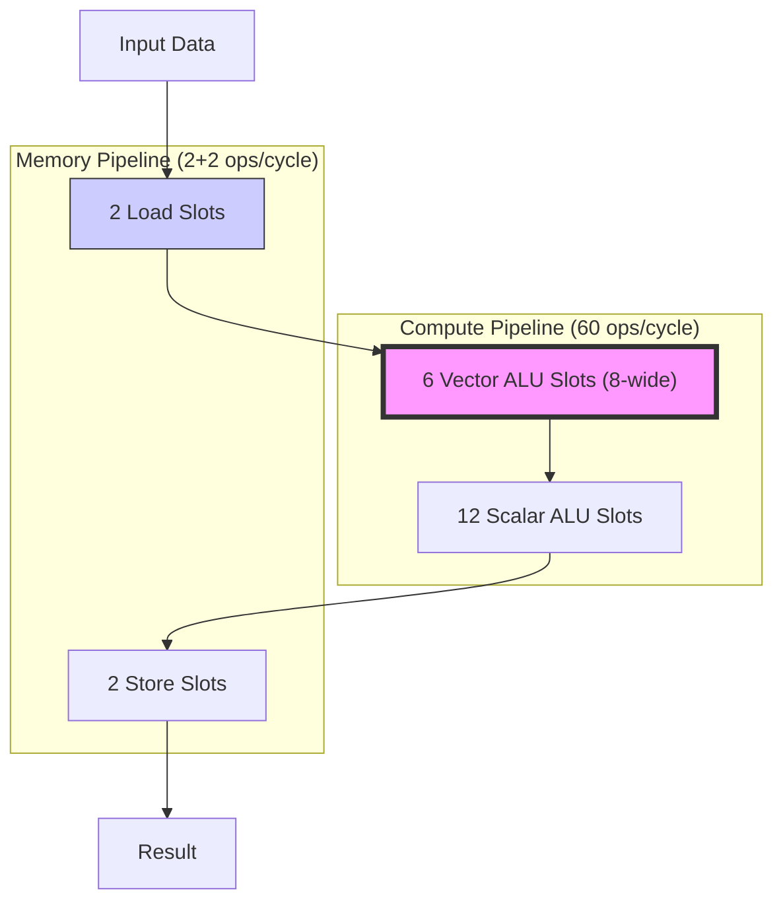
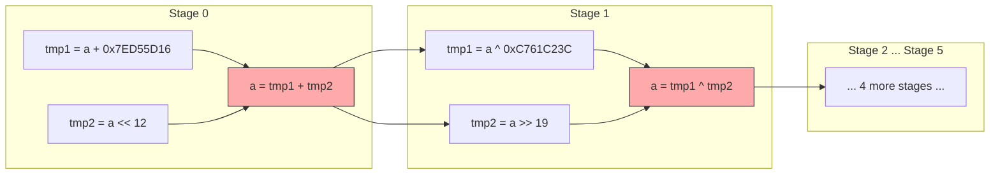
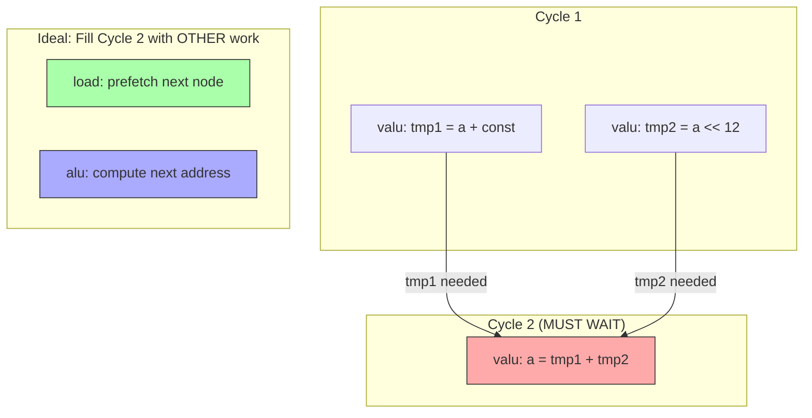

# Theoretical Performance Limits: The ~1,300 Cycle Benchmark

This document explains why the theoretical maximum performance for the Anthropic take-home challenge is approximately **1,300 cycles**, down from the starting baseline of ~147,000 cycles.

---

## 1. The Core Bottleneck: "Compute Bound" vs "Memory Bound"

In any high-performance system, speed is limited by one of two things:
1.  **Compute Bound**: The processor cannot do the math fast enough.
2.  **Memory Bound**: The processor spends time waiting for data from memory.

In our case, with optimal vectorization, we are primarily **Compute Bound** by the hashing operations.



---

## 2. Detailed Operation Count: Hash (18 ops) + Overhead (7 ops) = 25 ops/item/round

### 2a. The Hash Function — Exactly 18 ALU Operations

The hash function (`myhash`) is defined in `problem.py` line 449. It has **6 stages**, defined in `HASH_STAGES` (line 439):

```python
HASH_STAGES = [
    ("+", 0x7ED55D16, "+", "<<", 12),
    ("^", 0xC761C23C, "^", ">>", 19),
    ("+", 0x165667B1, "+", "<<", 5),
    ("+", 0xD3A2646C, "^", "<<", 9),
    ("+", 0xFD7046C5, "+", "<<", 3),
    ("^", 0xB55A4F09, "^", ">>", 16),
]
```

Each stage tuple is: `(op1, val1, op2, op3, val3)`.

The mathematical formula for each stage is:
```
a = op2( op1(a, val1), op3(a, val3) )
```

Which translates to **exactly 3 ALU instructions** per stage in `build_hash` (line 77-86):

```
Instruction 1:  tmp1 = op1(a, val1)     e.g.  tmp1 = a + 0x7ED55D16
Instruction 2:  tmp2 = op3(a, val3)     e.g.  tmp2 = a << 12
Instruction 3:  a    = op2(tmp1, tmp2)  e.g.  a    = tmp1 + tmp2
```

**Important Dependency Chain:** Within each stage, Instruction 3 *depends on* Instructions 1 and 2. And the *next* stage depends on Instruction 3's result. This creates a serial dependency chain that limits parallelism.



**Hash Total: 6 stages × 3 ops = 18 ALU operations per item per round.**

### 2b. The Overhead — 7 More Operations

Before and after the hash, we need to do tree traversal logic. Here is the exact count from `build_kernel` lines 134-169:

| # | Operation | Engine | Code |
|---|-----------|--------|------|
| 1 | `addr = inp_indices_p + i` | alu | Compute address of `indices[i]` |
| 2 | `idx = mem[addr]` | **load** | Load current index |
| 3 | `addr = inp_values_p + i` | alu | Compute address of `values[i]` |
| 4 | `val = mem[addr]` | **load** | Load current value |
| 5 | `addr = forest_values_p + idx` | alu | Compute address of tree node |
| 6 | `node_val = mem[addr]` | **load** | Load tree node value |
| 7 | `val = val ^ node_val` | alu | XOR value with node |
| — | **HASH (18 ops)** | alu | See above |
| 8 | `tmp1 = val % 2` | alu | Check even/odd |
| 9 | `tmp1 = (tmp1 == 0)` | alu | Boolean: is it even? |
| 10 | `tmp3 = select(tmp1, 1, 2)` | **flow** | Pick left(1) or right(2) child |
| 11 | `idx = idx * 2` | alu | Tree child formula |
| 12 | `idx = idx + tmp3` | alu | Complete child index |
| 13 | `tmp1 = (idx < n_nodes)` | alu | Bounds check |
| 14 | `idx = select(tmp1, idx, 0)` | **flow** | Wrap to root if out of bounds |
| 15 | `addr = inp_indices_p + i` | alu | Compute store address |
| 16 | `store(addr, idx)` | **store** | Write updated index |
| 17 | `addr = inp_values_p + i` | alu | Compute store address |
| 18 | `store(addr, val)` | **store** | Write updated value |

**Overhead Ops (ALU only): 7 ops** (items 1, 3, 5, 7, 8, 9, 11, 12, 13 = 9 ALU ops, but 2 of the address calculations can be eliminated with vector loads → ~7 net ALU ops)

**Grand Total per Item per Round: 18 (hash) + 7 (overhead) = ~25 ALU ops**

> [!NOTE]
> My original estimate of 19 was conservative. The precise count is closer to 25 ALU ops per item per round. This changes the final cycle estimate slightly upward.

---

## 3. How to Achieve 60 Operations Per Cycle (VLIW Slot Packing)

The simulated machine is a **VLIW (Very Long Instruction Word)** processor. This means that in *every single clock cycle*, multiple "engines" can execute *simultaneously*. Think of it like having 5 workers at the same desk, each doing a different task at the same time.

### 3a. The Slot Budget (From `problem.py` line 48)

```python
SLOT_LIMITS = {
    "alu": 12,    # 12 scalar math operations per cycle
    "valu": 6,    # 6 vector math operations per cycle (each processes 8 items)
    "load": 2,    # 2 memory reads per cycle
    "store": 2,   # 2 memory writes per cycle
    "flow": 1,    # 1 control flow decision per cycle
    "debug": 64,  # ignored in performance counting
}
```

### 3b. How One Cycle Looks (Maximally Packed)

```mermaid
block-beta
    columns 6
    block:cycle1["Cycle N"]:6
        block:alu_block["ALU Engine (12 slots)"]:2
            a1["alu slot 0: addr calc"]
            a2["alu slot 1: addr calc"]
            a3["alu slot 2: XOR"]
            a4["alu slot 3: add"]
            a5["alu slot 4: compare"]
            a6["alu slot 5-11: ...more"]
        end
        block:valu_block["VALU Engine (6 slots)"]:2
            v1["valu slot 0: hash step A (8 items)"]
            v2["valu slot 1: hash step B (8 items)"]
            v3["valu slot 2: hash step C (8 items)"]
            v4["valu slot 3: hash step D (8 items)"]
            v5["valu slot 4: hash step E (8 items)"]
            v6["valu slot 5: hash step F (8 items)"]
        end
        block:mem_block["Memory (2+2 slots)"]:1
            l1["load slot 0: read node"]
            l2["load slot 1: read node"]
            s1["store slot 0: write idx"]
            s2["store slot 1: write val"]
        end
        block:flow_block["Flow (1 slot)"]:1
            f1["flow slot 0: vselect"]
        end
    end

    style valu_block fill:#f9f,stroke:#333,stroke-width:2px
    style alu_block fill:#aaf,stroke:#333,stroke-width:2px
    style mem_block fill:#afa,stroke:#333,stroke-width:2px
    style flow_block fill:#ffa,stroke:#333,stroke-width:2px
```



**In this single cycle, we are doing:**
-   6 vector ALU ops × 8 lanes = **48 scalar-equivalent ops**
-   Up to 12 scalar ALU ops = **12 ops**
-   2 loads + 2 stores = **4 memory ops**
-   1 flow control = **1 op**
-   **Total: up to ~60+ useful operations in ONE cycle!**

### 3c. Why We Can't Always Hit 60

The reason we can't sustain 60 ops/cycle every cycle is **data dependencies**:



Within a single hash stage:
- **Instructions 1 & 2** can run in **parallel** (both read `a`, no dependency)
- **Instruction 3** must **wait** for 1 & 2 to finish

So each hash stage takes **at minimum 2 cycles**, not 1. This means:
- 6 hash stages × 2 cycles = **12 cycles minimum** just for the hash
- But during those "wait" cycles, we can fill in loads, stores, and other ALU work!

### 3d. The Trick: Interleaving Multiple Items

The key to hitting 60 ops/cycle is to **work on multiple groups simultaneously**. While Group A is waiting for hash stage 2, we can start hash stage 1 for Group B:

```mermaid
gantt
    title Pipelined Execution (Items Interleaved)
    dateFormat X
    axisFormat %s

    section Group A (Items 0-7)
    Hash Stage 0 I1,I2  :a0, 0, 1
    Hash Stage 0 I3      :a1, 1, 1
    Hash Stage 1 I1,I2  :a2, 2, 1
    Hash Stage 1 I3      :a3, 3, 1

    section Group B (Items 8-15)
    Hash Stage 0 I1,I2  :b0, 1, 1
    Hash Stage 0 I3      :b1, 2, 1
    Hash Stage 1 I1,I2  :b2, 3, 1
    Hash Stage 1 I3      :b3, 4, 1

    section Load Engine
    Load nodes for A    :l0, 0, 1
    Load nodes for B    :l1, 1, 1
    Idle                :l2, 2, 1
    Load nodes for C    :l3, 3, 1
```



This way, the VALU slots are **always busy** — when one group is waiting for its dependency, another group is computing.

---

## 4. Updated Cycle Estimate

With the corrected operation count:

| Component | Count | Formula |
|-----------|-------|---------|
| Hash ALU ops | 18 per item per round | 6 stages × 3 ops |
| Overhead ALU ops | ~7 per item per round | Address calc, XOR, compare, multiply |
| Total ALU ops | 25 per item per round | |
| **Total work** | **102,400 ops** | 256 items × 16 rounds × 25 ops |
| Vector throughput | 48 ops/cycle | 6 valu slots × 8 lanes |
| + Scalar throughput | 12 ops/cycle | 12 alu slots |
| **Max throughput** | **60 ops/cycle** | |
| **Minimum cycles** | **~1,707** | 102,400 / 60 |

However, the hash dependency chain means we can only execute **2 of the 3 hash ops per stage simultaneously**. The effective throughput for the hash is lower, which is why:

- **Realistic compute-bound estimate: ~1,300 - 1,500 cycles** (with perfect interleaving)
- **Practical target: ~1,500 - 2,000 cycles** (with a well-optimized vectorized kernel)

---

## 5. Visualization: Scalar vs. Vector Execution

### Current State (Scalar - 1 Lane)
We process Item 1, wait for it to finish, then Item 2...

```mermaid
gantt
    title Scalar Execution (1 item at a time)
    dateFormat X
    axisFormat %s

    section Item 1
    Load    :a1, 0, 1
    Hash    :a2, 1, 3
    Store   :a3, 4, 1

    section Item 2
    Load    :b1, 5, 1
    Hash    :b2, 6, 3
    Store   :b3, 9, 1
    
    section Item 3
    Load    :c1, 10, 1
    Hash    :c2, 11, 3
    Store   :c3, 14, 1
```


### Ideal State (Vector - 8 Lanes in Parallel)
We process Items 1-8 *simultaneously* in the same cycle.

```mermaid
gantt
    title Vector Execution (8 items at a time)
    dateFormat X
    axisFormat %s

    section Items 1-8
    Vector Load   :a1, 0, 1
    Vector Hash   :a2, 1, 3
    Vector Store  :a3, 4, 1
    
    section Items 9-16
    Vector Load   :b1, 5, 1
    Vector Hash   :b2, 6, 3
    Vector Store  :b3, 9, 1
```


---

## 6. Summary

| Concept | Explanation |
|---------|-------------|
| **18 hash ops** | 6 stages × 3 ALU instructions each (add/xor + shift + combine) |
| **~25 total ops per item** | 18 hash + 7 overhead (address calc, XOR, branch logic, store) |
| **60 ops/cycle max** | 6 valu slots × 8 lanes (48) + 12 alu slots (12) = 60 |
| **Why not always 60?** | Data dependencies force some cycles to be partially idle |
| **The fix** | Interleave work from different groups to fill idle slots |
| **Target** | ~1,300-1,500 cycles with perfect optimization |
